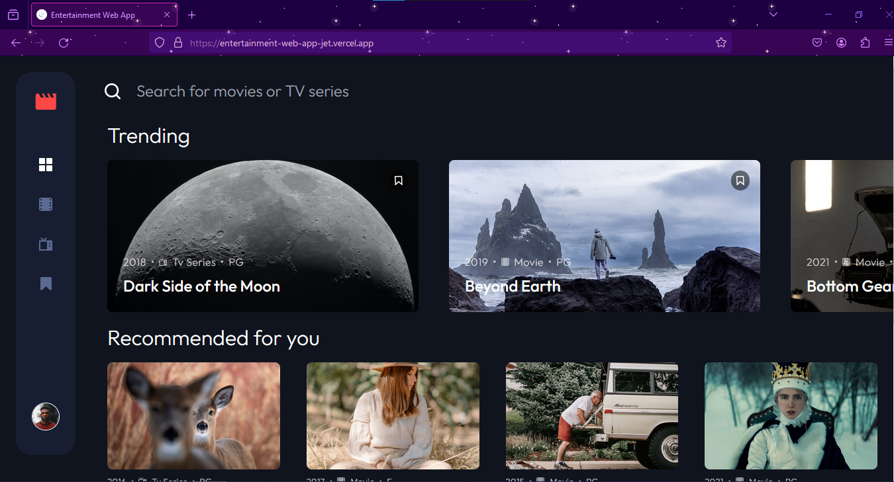

# Frontend Mentor - Entertainment web app solution

This is a solution to the [Entertainment web app challenge on Frontend Mentor](https://www.frontendmentor.io/challenges/entertainment-web-app-J-UhgAW1X). Frontend Mentor challenges help you improve your coding skills by building realistic project.

## Table of contents

- [Overview](#overview)
  - [The challenge](#the-challenge)
  - [Screenshot](#screenshot)
  - [Links](#links)
- [My process](#my-process)
  - [Built with](#built-with)
  - [What I learned](#what-i-learned)
  - [Continued development](#continued-development)
  - [Useful resources](#useful-resources)
- [Author](#author)
- [Acknowledgments](#acknowledgments)

## Overview

### The challenge

Users should be able to:

- View the optimal layout for the app depending on their device's screen size
- See hover states for all interactive elements on the page
- Navigate between Home, Movies, TV Series, and Bookmarked Shows pages
- Add/Remove bookmarks from all movies and TV series
- Search for relevant shows on all pages
- **Bonus**: Build this project as a full-stack application
- **Bonus**: If you're building a full-stack app, we provide authentication screen (sign-up/login) designs if you'd like to create an auth flow

### Screenshot



### Links

- [Solution URL](https://www.frontendmentor.io/solutions/entertainment-web-app-mern-and-tailwindcss-NtpXwPkwSn)
- [Live Site URL](https://entertainment-web-app-jet.vercel.app/)

## My process

### Built with

- Semantic HTML5 markup
- CSS custom properties
- Flexbox
- CSS Grid
- Desktop-first workflow
- [React](https://reactjs.org/) - JS library
- [TailwindCSS](https://tailwindcss.com/) - CSS library
- [Node](https://nodejs.org/en) - JS Runtime
- [MongoDB](https://www.mongodb.com) - Database
- [Express](https://expressjs.com/) - Backend Frameword
- [Cloudinary](https://cloudinary.com/) - Image and Video API

### What I learned

I learned so many things. The reason I started this challenge was because I wanted to learn React Router V6 with Data Loading and Actions. I also learned how to prgressively load images. I implemented debouncing in a search function. I made custom hooks, solved cors issues with deploying frontend and backend in separate places, axios instances, using aria attributes in tailwind for accesibility, etc.

Here are some code snippets I am proud of:

Accessible Toggle Menu:

```JSX
<div className="relative mt-auto" ref={menuRef}>
  <button
    aria-label="toggle user menu"
    aria-controls="user-menu"
    aria-expanded={!menuHidden}
    onClick={() => setMenuHidden((prev) => !prev)}
    className={`aspect-square overflow-hidden rounded-full border relative before:absolute before:inset-0 before:bg-secondary-dark before:z-50 before:transition before:${loaded ? 'opacity-0' : 'opacity-100'} transition ${menuHidden ? 'border-white' : 'border-accent'} hover:border-accent focus-visible:border-accent outline-0`}
  >
     setLoaded(true)}
    />
  </button>

  <ul
    role="list"
    id="user-menu"
    aria-hidden={menuHidden}
    className="aria-hidden:opacity-0 opacity-100 w-44 absolute right-0 sm:-right-6 md:right-0 md:top-auto md:left-0 md:-translate-y-12 md:translate-x-24 aria-hidden:scale-90 scale-100 translate-y-10 rounded-lg bg-secondary-dark p-1 text-accent transition ease-in-out"
  >
    <li>
      <button
        tabIndex={menuHidden ? -1 : 0}
        onClick={logout}
        className={`${menuHidden ? 'pointer-events-none' : ''} w-full rounded-[4px] py-2 transition hover:bg-primary focus-visible:bg-primary`}
      >
        Log out
      </button>
    </li>
  </ul>
</div>
```

CORS:

```JS
app.use(
  cors({
    origin: process.env.CLIENT_URL,
    credentials: true,
  }),
);
```

```JS
import axios from 'axios';

const api = axios.create({
  baseURL: import.meta.env.VITE_SERVER_URL,
  withCredentials: true,
});

export default api;
```

Progressive Images:

```JSX
<picture
  className={`${className} ${
    loaded ? "" : "aspect-[20/9]"
  } relative before:absolute before:inset-0 before:rounded-lg before:bg-secondary-dark before:z-50 before:transition before:${
    loaded ? "opacity-0" : "opacity-100"
  }`}
>
  <source
    srcSet={`${data.large}.jpg`}
    type="image/jpg"
    media="(min-width: 768px)"
  />
  <source
    srcSet={`${data.large}.webp`}
    type="image/webp"
    media="(min-width: 768px)"
  />
  <source
    srcSet={`${data.large}.avif`}
    type="image/avif"
    media="(min-width: 768px)"
  />
  <source
    srcSet={`${data.large}.png`}
    type="image/png"
    media="(min-width: 768px)"
  />

  <source srcSet={`${data.small}.avif`} type="image/avif" />
  <source srcSet={`${data.small}.png`} type="image/png" />
  <source srcSet={`${data.small}.jpg`} type="image/jpg" />

   setLoaded(true)}
  />
</picture>
```

### Continued development

I would love to integrate a movie api to give the app a more real feel. I would also like to prevent loader waterfall but there is no way to do that yet in React Router V6.

### Useful resources

- [React Debounce Search Input API Call | useDebounce React Hook ](https://www.youtube.com/watch?v=MHm-2YmWEek) - This helped me learn the concept of debouncing and fetching search results efficiently.


## Acknowledgments

I want to thank Frontend Mentor for these amazing challenges. As a developer it is really hard to find designs anywhere but Frontend Mentor not only provides designs but also provides resources that help us get better at web development.
